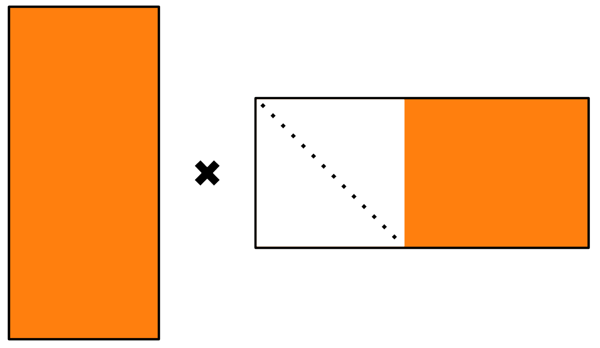
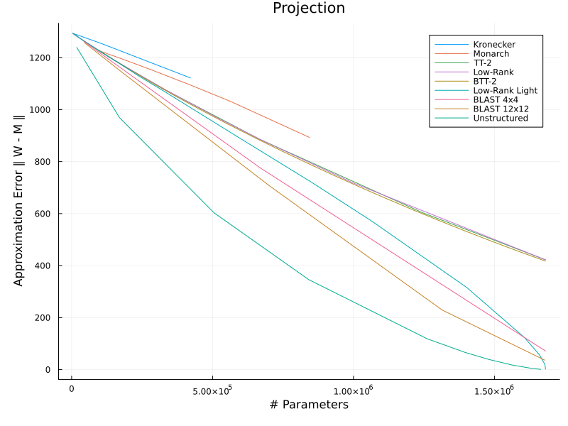
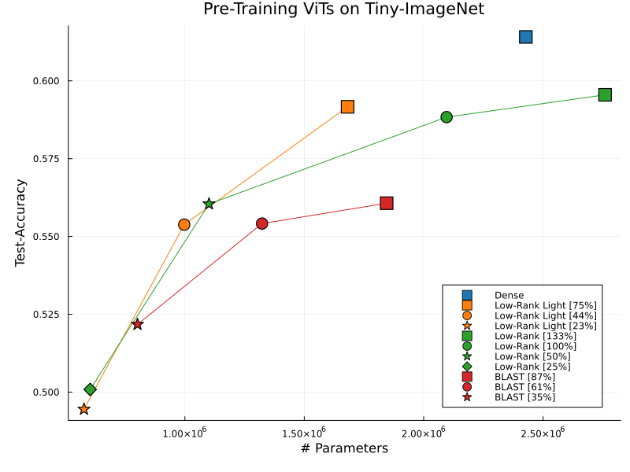
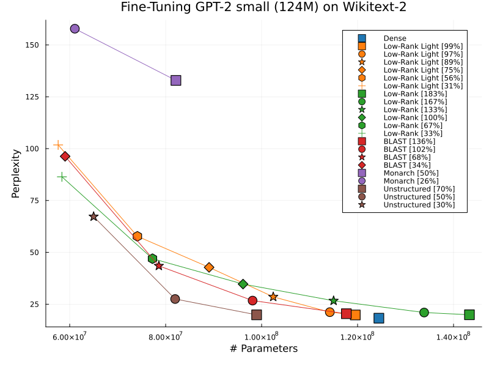

# Master Thesis: Memory Better Spent

## Parameter-Efficient Machine Learning with Structured Matrices

This repository contains the code for the master thesis "Memory Better Spent", comparing different structured sparsity formats in machine learning from an *efficiency per parameter* perspective.

The thesis has been published in the [ETH Zürich Research Collection](https://doi.org/10.3929/ethz-c-000784403)

Sparsity is used to reduce the size of machine learning models. While unstructured sparsity techniques are widely used and offer the best tradeoff between memory-requirements and model-accuracy, their unstructured nature makes them suboptimal for modern accelerator hardware. Structured sparsity can offer more compute-efficient alternatives. 

We can visually illustrate different structured sparsity formats, such as Low-Rank, Monarch, BlockTensorTrain and BLAST, by using them for image compression: 


## Low-Rank Light

We develop a new structured sparsity format, Low-Rank Light. It works by parameterizing Low-Rank matrices with fewer parameters than a standart Low-Rank product. 

This is an illustration of the Low-Rank Light product. Parameters are saved compared to standart Low-Rank by fixing the left part of the second factor to be the identity matrix. 




## Results

A series of experiments have been conducted to assess the general viability of the different structured sparsity formats in a machine learning setting.  

### Projection

We compare how well different matrix types can approximate a given matrix filled with random numbers drawn from a gaussian distribution. Unstructured sparsity serves as a lower bound on the achievable approximation error. We see different matrix types achieve different approximation error per parameter, indicating that some formats are more parameter-efficient than others. 



### Pre-Training

In our pre-training experiments we train sparse vision transformers from scratch. The dense weight matrices in the linear layers of the transformer architecture have been replaced by structured sparse matrices. We can observe that Low-Rank Light is more suitable for pre-training than standart Low-Rank in this case. 



### Fine-Tuning

Additionally, we fine-tune sparsified GPT2 language models. Parameter-redundancies as in the projection results become again apparent. Interestingly, standart Low-Rank matrices achieve the best scaling behaviour in this experiment. 
 


## Installation

1. To run the code, first follow the instructions online to install [Julia](https://julialang.org/downloads/) and [Python](https://www.python.org/downloads/) programming languages.

2. Clone the repository
```bash
git clone https://github.com/Zhurgut/MemoryBetterSpent.git
cd MemoryBetterSpent
```

3. Set up the python virtual environment. 

```bash
python -m .venv
source .venv/bin/activate   # or `venv\Scripts\activate` on Windows
```

4. Install the relevant Python packages. The `requirements.txt` file lists the package versions used during development. 

Follow the instructions online to install [Pytorch](https://pytorch.org/get-started/locally/). Then run

```bash
pip install datasets, numpy, tokenizers, transformers, torcheval
```

5. Also install the required Julia packages. In the Julia REPL, type 
```bash
] add JSON3, CSV, DataFrames, Plots, Latexify
```

6. Training commands can be specified in `src/train_commands.jl` and executed by calling
```bash
julia src/train_commands.jl
```


## License

Memory Better Spent © 2025 by Damian Camenisch is licensed under CC BY-NC 4.0. To view a copy of this license, visit https://creativecommons.org/licenses/by-nc/4.0/

